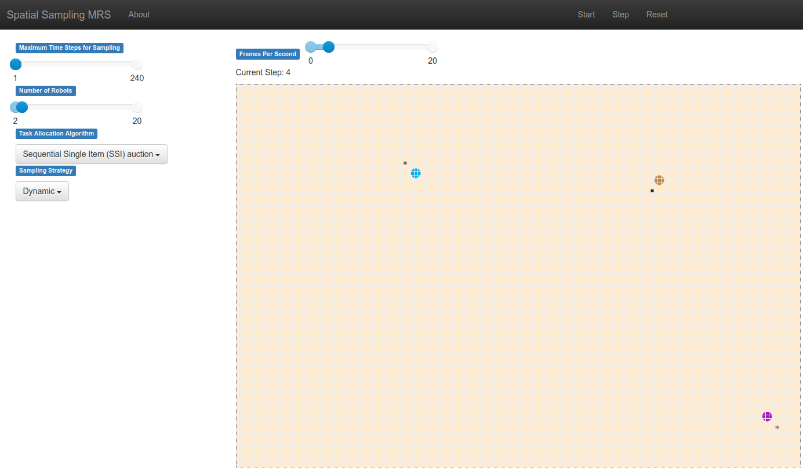

[Home](https://github.com/laurencejbelliott/Spatial_Sampling_MRS_Simulation/) | [Accessing Simulation Outputs](/docs/sim-outputs.md) | [Model Parameters](/docs/model-parameters.md) | [Sampling Custom Data](/docs/custom-data.md) 
# Spatial Sampling Multi-Robot System Simulation
A 2D grid-based simulation of a spatial sampling Multi-Robot System (MRS).
Created using the MESA agent-based modelling framework for Python. 
This simulation is developed as a platform for simulated experiments to compare the
performance of different combinations of task allocation and sampling methods for 
multi-robot mapping of spatial data. Its abstract representation of a MRS
allows many experiments to be conducted quickly, with low computational complexity.
It also includes interactive visualisation with easy control of parameters.
By default, the simulated MRS samples surface soil compaction data, recorded using
an outdoor Thorvald robot at the University of Lincoln's Riseholme campus by 
Jaime Fentanes et al. Further details of their dataset and their work on robotic soil
compaction sampling can be found in [3D Soil Compaction Mapping through Kriging-based Exploration with a Mobile Robot](https://arxiv.org/abs/1803.08069).
This data is measured in Kpa, and is interpolated by this simulation using kriging,
so that samples can be taken from ground-truth data at arbitrary locations.

You can provide the simulation with your own geolocated data for the robots to sample, following the instructions
in [Sampling Custom Data](/docs/custom-data.md).

## Dependencies
The simulation runs entirely in Python 3, requiring the following packages to be 
installed with:
`pip install mesa numpy astar-python PyKrige matplotlib`.
The simulation has been tested to work on Ubuntu 18.04, Windows 10, and Windows 11. It may work on other operating systems,
but these have not been tested.

## Running the simulation
To run the simulation, use the bash command `mesa runserver` with your working directory
set to that of `mesa_spatial_sampling_MRS`.
If the `mesa` command is not found, and you have installed mesa in a virtual environment,
ensure that you have activated this environment before running this command.

Alternatively, you can run the Python script `run.py`.

If all has been set up correctly, running the simulation should open a web page in
your default internet browser for visualisation.
It should resemble this screenshot:

Instructions on using this grid visualisation web UI can be found in the [Grid Visualisation section of MESA's advanced tutorial](https://mesa.readthedocs.io/en/latest/tutorials/adv_tutorial.html#grid-visualization).

## Running Batches of Simulated Experiments
An example script for running headless batches of experiments is provided in `BatchRunner_RR_and_SSI.py`. This script reproduces
the simulated trials detailed in Roberts-Elliott et al.'s TAROS 2022 paper ['Agent-Based Simulation of Multi-Robot Soil 
Compaction Mapping'](https://doi.org/10.1007/978-3-031-15908-4_20). The automation of batches of experiments is powered 
by [Mesa's BatchRunnerMP class](https://mesa.readthedocs.io/en/latest/apis/batchrunner.html). Although this supports
multiprocessing, the script defaults to running trials sequentially on a single core, as some features of the simulated 
MRS use multiprocessing, e.g. [PyKrige](https://github.com/GeoStat-Framework/PyKrige) kriging interpolation.
The [Accessing Simulation Outputs](/docs/sim-outputs.md) section of this documentation details how to
access the data and figures generated from batches of simulated experiments.