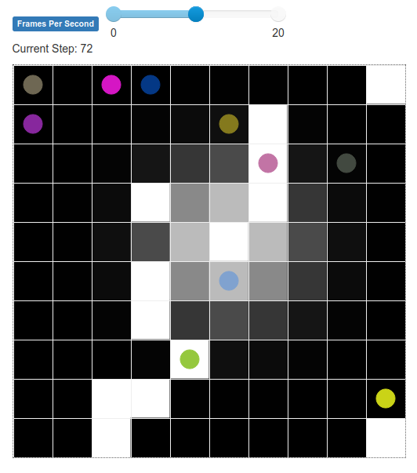

# Spatial Sampling Multi-Robot System Simulation
A 2D grid-based simulation of a spatial sampling Multi-Robot System.
Created using the MESA agent-based modelling framework for Python. 
This simulation is being developed as a platform for simulated experiments in multi-robot co-ordination for soil properties mapping. Its high level abstraction of the soil properties problem, to allow many experiments to be conducted quickly, with low computational complexity, intuitive visualisation of the world and performance metrics, and easy control of parameters.

## Dependencies
The simulation runs entirely in Python 3, requiring the following packages to be installed with:
`pip install mesa numpy astar-python`

## Running the simulation
To run the simulation, use the bash command `mesa runserver` with your working directory set to that of `mesa_spatial_sampling_MRS`.
If the `mesa` command is not found, and you have installed mesa in a virtual environment, ensure that you have activated this environment before running this command.

Alternatively, you can run the Python script `run.py`.

If all has been set up correctly, running the simulation should open a web page in your default browser for visualisation.
It should resemble this screenshot:

Instructions on using this grid visualisation can be found in the [Grid Visualization section of MESA's advanced tutorial](https://mesa.readthedocs.io/en/master/tutorials/adv_tutorial.html#grid-visualization). 