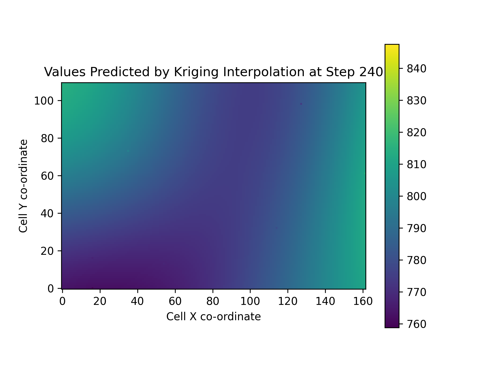
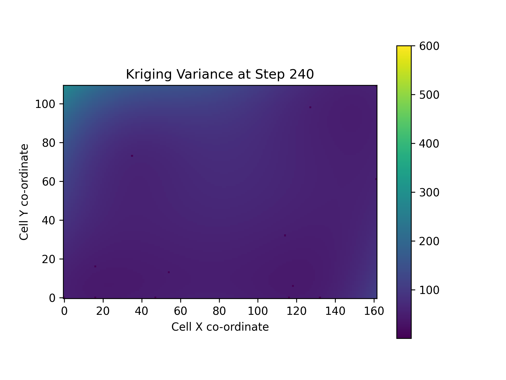
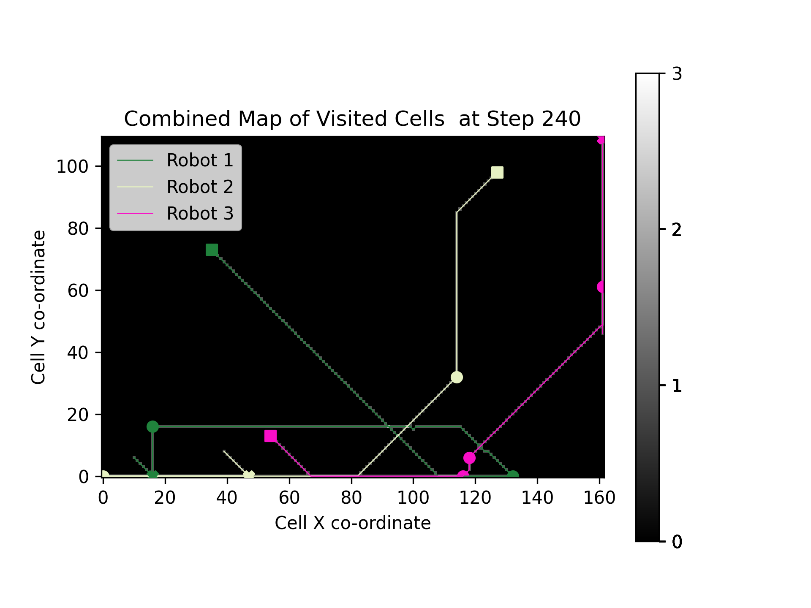

[Home](https://github.com/laurencejbelliott/Spatial_Sampling_MRS_Simulation/) | [Accessing Simulation Outputs](/docs/sim-outputs.md) | [Model Parameters](/docs/model-parameters.md) | [Sampling Custom Data](/docs/custom-data.md)

# Accessing Simulation Outputs
By default, simulation runs executed via `run.py` will save output data and additional graphical outputs
in `\mesa_spatial_sampling_MRS\results\default\1\`.
Within this directory, `1.csv` contains data on the performance of the simulated multi-robot system
recorded at each step of the simulated sampling mission.
This file and the directory it resides in are named `1` after the iteration number of the simulated run, 
used as a seed for randomised variables such as the starting positions of the robots.

Visual outputs are also saved in this folder. The names of these are prefixed with the simulation 
time step at which they were generated. These are figures generated with Matplotlib at every x steps 
of the simulation. The frequency of figure generation is controlled by the `vis_freq` parameter of the
`SpatialSamplingModel` class, which can be changed in the `model_params` dictionary in `server.py` for running the
simulation with the web UI, or in the `fixed_parameters` dictionary argument of the `BatchRunnerMP` constructor in
`BatchRunner_RR_and_SSI.py` for running headless batches of simulated experiments.

The following figures are generated:

### Heatmap of Values Predicted by Kriging Interpolation
Saved as `x_Interpolation.png`, where x is the time step at which the figure was generated.  These values are
soil compaction in KPa.

### Heatmap of Kriging Variance
Saved as `x_Variance.png`, where x is the time step at which the figure was generated. Kriging
variance is a per-cell measure of the uncertainty of Kriging interpolation's prediction of the soil compaction value.

### Per-robot Heatmaps of Visited Cells With Trajectory and Sampling Points
Saved as `x_<robot_id>_visited_cells.png`, where x is the time step at which the figure was generated, and `<robot_id>` is
the ID of the robot, generated from its initial position. The robot's trajectory and sampling points are overlaid on 
top of the heatmap of visited cells.
_visited_cells.png "A heatmap of a single robot's visited cells, overlaid with its trajectory and sampling points.")

### Combined Heatmap of Visited Cells With Trajectories and Sampling Points
Saved as `x_combined_visited_cells.png`, where x is the time step at which the figure was
generated. The trajectories and sampling points of all robots are overlaid on top of a
heatmap of the number of visits made to each cell by the whole robot team.

### Generating Animated GIFs of visual outputs
The ['animate_graphical_output.py'](/mesa_spatial_sampling_MRS/animate_graphical_output.py) script can be used to
generate animated GIFs of the above figures. Just change the value of `path_to_png_files` to the path containing the
png images generated from the simulation, e.g. `"results/default/1/"`. To animate the figures generated from a batch of
simulations, run ['animate_batchrunner_vis.py'](/mesa_spatial_sampling_MRS/animate_batchrunner_vis.py). You may need to
modify the script to call the `animate_batch` function, providing the path to the batch's outputs, and the number of
trials you wish to animate, e.g. `animate_batch("results/RR_DS_3robs_20x20/", 10)`.
